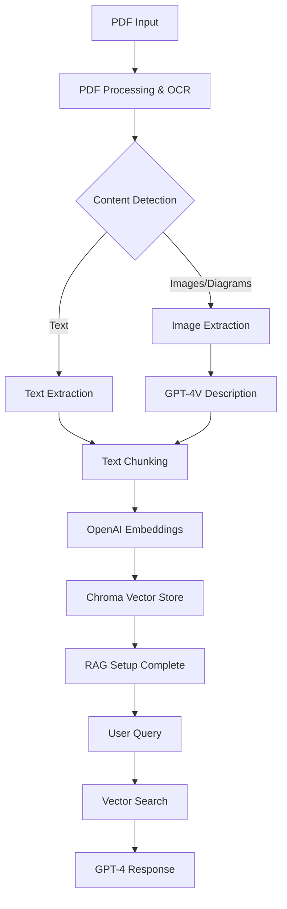

# quick_ragsearch_pipeline

## Overview

A streamlined AI system for processing lecture PDFs through OCR, multimodal understanding, embedding generation, and intelligent Q&A. Built with OpenAI models, LangChain, and LangGraph for a robust and extensible foundation that can be made modular in the future.

## Architecture Philosophy

### Current Approach (V1)
- **Simplicity First**: Single provider (OpenAI) for all AI components
- **Proven Stack**: LangChain + LangGraph + OpenAI for reliability
- **Functional Focus**: Get the core workflow working perfectly
- **Future-Ready**: Designed with extension points for later modularity

### OpenAI Model Stack
- **LLM**: GPT-4o mini for reasoning, summarization, and Q&A
- **Embeddings**: text-embedding-3-large for vector representations
- **Multimodal**: also gpt-4o mini in this case for image/diagram description (for now it is the same model with the LLM but seperate it since we are going to distinguish the usage of model in the future)

## System Workflow



## Processing Pipeline

### 1. Document Ingestion
- PDF upload and validation
- OCR processing with pdfplumber/PyPDF2
- Image extraction and preprocessing

### 2. Content Processing
- **Text**: Extract and clean text content
- **Images**: Use GPT-4o mini to generate detailed descriptions of diagrams, charts, figures
- **Integration**: Combine text and image descriptions with proper context

### 3. Embedding & Storage
- Chunk text into semantic segments
- Generate embeddings using OpenAI's text-embedding-3-large
- Store in weviate vector database with metadata

### 4. Q&A System
- Process user queries
- Retrieve relevant chunks via similarity search
- Generate responses using LLM with retrieved context

## Simplified Project Structure

```
│
├── README.md
├── requirements.txt
├── .env.example
├── config.py                   # Simple configuration
│
├── src/
│   ├── __init__.py
│   ├── main.py                 # Main orchestration
│   │
│   ├── processors/
│   │   ├── __init__.py
│   │   ├── pdf_processor.py    # PDF parsing and OCR
│   │   ├── image_processor.py  # Image extraction and description
│   │   ├── text_processor.py   # Text chunking and cleaning
│   │   └── embedder.py         # Embedding generation
│   │
│   ├── storage/
│   │   ├── __init__.py
│   │   └── vector_store.py     # Chroma integration
│   │
│   ├── workflows/
│   │   ├── __init__.py
│   │   ├── document_workflow.py # LangGraph document processing
│   │   └── qa_workflow.py       # LangGraph Q&A system
│   │
│   └── utils/
│       ├── __init__.py
│       ├── logger.py
│       └── helpers.py
│
├── workflows/               # LangGraph workflow definitions
│   ├── __init__.py
│   ├── process_document.py
│   └── qa_system.py
│
├── api/                    # Optional FastAPI interface
│   ├── __init__.py
│   ├── main.py
│   └── routes.py
│
├── tests/
│   ├── __init__.py
│   ├── test_processors.py
│   └── test_workflows.py
│
├── examples/
    ├── basic_usage.py
    └── sample_pdfs/
```

## Key Components

### PDF Processor
```python
# Simple, focused PDF processing
class PDFProcessor:
    def extract_text_and_images(self, pdf_path):
        # Extract text using pdfplumber
        # Identify and extract images
        # Return structured content
```

### Image Processor  
```python
# GPT-4V for image understanding
class ImageProcessor:
    def describe_image(self, image_data, context=""):
        # Use GPT-4V to generate detailed descriptions
        # Include context from surrounding text
        # Return structured description
```

### Text Processor
```python
# Smart text chunking and preparation
class TextProcessor:
    def chunk_content(self, text, images_descriptions):
        # Semantic chunking with LangChain
        # Integrate image descriptions
        # Maintain context and relationships
```

### Vector Store
```python
# Simple Chroma integration
class VectorStore:
    def add_documents(self, chunks, embeddings, metadata):
        # Store in Chroma with OpenAI embeddings
        # Include rich metadata for filtering
```

## LangGraph Workflows

### Document Processing Workflow
```python
# Orchestrate the entire document processing pipeline
def create_document_workflow():
    workflow = StateGraph(DocumentState)
    
    workflow.add_node("extract_pdf", extract_pdf_content)
    workflow.add_node("process_images", process_images_with_gpt4v)  
    workflow.add_node("chunk_text", chunk_and_prepare_text)
    workflow.add_node("generate_embeddings", create_embeddings)
    workflow.add_node("store_vectors", store_in_chroma)
    
    # Define workflow edges and conditions
    return workflow
```

### Q&A Workflow
```python
# Handle questions and generate responses
def create_qa_workflow():
    workflow = StateGraph(QAState)
    
    workflow.add_node("process_query", process_user_query)
    workflow.add_node("search_vectors", search_similar_chunks)
    workflow.add_node("generate_response", generate_gpt4_response)
    
    return workflow
```

## Configuration

### Simple Environment Configuration
```python
# config.py
import os

OPENAI_API_KEY = os.getenv("OPENAI_API_KEY")

# Model settings
LLM_MODEL = "gpt-4-turbo-preview"
EMBEDDING_MODEL = "text-embedding-3-large" 
VISION_MODEL = "gpt-4-vision-preview"

# Processing settings
CHUNK_SIZE = 1000
CHUNK_OVERLAP = 200
MAX_TOKENS = 4000

# Vector store settings
CHROMA_PERSIST_DIR = "./chroma_db"
COLLECTION_NAME = "lecture_documents"
```

## Usage Examples

### Basic Document Processing
```python
from src.main import LectureProcessor

# Initialize processor
processor = LectureProcessor()

# Process a PDF
result = processor.process_document("lecture.pdf")
print(f"Processed {result['chunks']} text chunks and {result['images']} images")

# Ask questions
answer = processor.ask_question("What are the main topics covered?")
print(answer)
```

### Batch Processing
```python
# Process multiple documents
documents = ["lecture1.pdf", "lecture2.pdf", "lecture3.pdf"]

for doc in documents:
    processor.process_document(doc)
    print(f"Processed {doc}")

# Query across all documents
answer = processor.ask_question("Compare the approaches discussed in all lectures")
```

## Development Roadmap

### Phase 1: Core Implementation (Current)
- [x] Basic PDF processing with OCR
- [ ] Image extraction and GPT-4V description
- [ ] Text chunking and embedding with OpenAI
- [ ] Chroma vector store integration
- [ ] LangGraph workflow orchestration
- [ ] Basic Q&A functionality

### Phase 2: sEnhancement
- [ ] Better error handling and logging
- [ ] Metadata extraction (titles, sections, etc.)
- [ ] Multiple document support
- [ ] FastAPI web interface
- [ ] Response streaming

### Phase 3: Future Modularity
- [ ] Abstract model interfaces
- [ ] Multiple provider support
- [ ] Plugin architecture
- [ ] Integration with existing modular codebase

## Technology Stack

- **AI Models**: OpenAI (GPT-4, GPT-4V, text-embedding-3-large)
- **Orchestration**: LangChain, LangGraph
- **Vector DB**: Chroma
- **PDF Processing**: pdfplumber, PyPDF2
- **Image Processing**: Pillow, OpenCV
- **API**: FastAPI (optional)
- **Environment**: Python 3.9+

## Installation & Setup

```bash
# Clone repository
git clone <repository-url>
cd pdf-lecture-processor

# Install dependencies
pip install -r requirements.txt

# Setup environment
cp .env.example .env
# Add your OPENAI_API_KEY to .env

# Run basic example
python examples/basic_usage.py
```

## Key Benefits of This Approach

1. **Quick to Market**: Get working system fast with proven components
2. **Single Provider**: Simplified debugging and consistent behavior  
3. **LangGraph Foundation**: Built-in workflow management and visualization
4. **Extension Ready**: Clear points to add modularity later
5. **Integration Path**: Easy to merge with existing modular codebase

## Future Integration Notes

- Model interfaces designed for easy abstraction
- Configuration structure supports multiple providers
- Workflow nodes can be made provider-agnostic
- Storage layer ready for different vector databases
- API design supports swappable backends

This approach gets you a fully functional system quickly while maintaining a clear path to the modular architecture you want to build later!